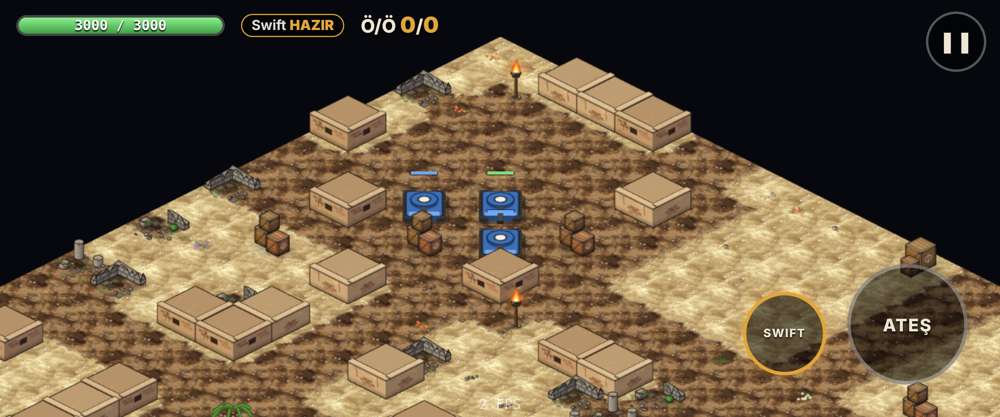
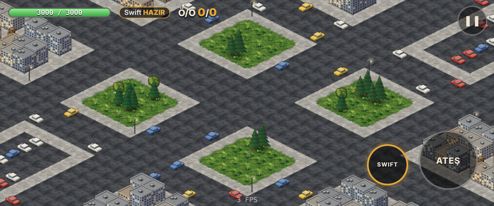
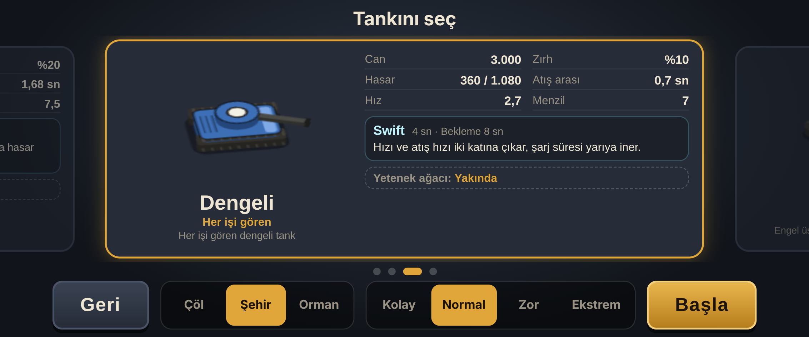

# Tanky Tunky

İnternetsiz oynanan, yatay ekranlı, izometrik bir Android tank oyunu. Botlara karşı 3'e 3 hızlı maç,
basılı tutarak güçlenen atışlar, her tanka özel yetenekler ve kutulardan toplanan yükseltmeler.



## Oyunda neler var

- **4 tank:** Çevik (hızlı, Saklan), Ağır (çok sağlam, Gümbürtü), Dengeli (Swift), Topçu (kavisli atış, Yaylım Ateşi).
  Değerler: [`docs/TANKS.md`](docs/TANKS.md)
- **3 harita:** Çöl harabesi, Modern şehir, Orman/nehir. Her maçta biraz farklı üretilir ve iki takım için simetriktir.
- **5 dakikalık maç**, 3-2-1 geri sayım, yeniden doğma, skor tablosu ve en iyi skor kaydı.
- **Basılı tutma:** atış şarj oldukça hasarı artar (×3'e kadar); tam dolunca bırakırsan ekstra bonus alırsın.
- **Kutulardan yükseltme:** her biri +%5 can ve hasar verir, en fazla +%60; ölünce sıfırlanır.
- **Can yenilenmesi:** çatışmadan 5 sn uzak kalınca her 5 sn'de +%5 can.
- **Bot zorluğu:** Kolay, Normal, Zor, Ekstrem.
- **Otomatik nişan** (ayarlardan kapatılabilir), dokunmatik joystick, ATEŞ ve YETENEK butonları.
- Türkçe, İngilizce ve Arapça dil desteği.

| Şehir haritası | Tank seçimi |
|---|---|
|  |  |

## Telefona kurmak

1. GitHub → **Actions** → **Android APK** → en yeni başarılı çalıştırma → **Artifacts** → `tanky-tunky-debug-N`.
2. Zip'i aç, `app-debug.apk` dosyasını telefona kur.
3. Her yeni APK eskisinin üstüne kurulur. Daima **en yüksek numaralı** APK'yı kur.
   Güncellemede "paket çakışıyor" hatası çıkarsa: [`docs/RELEASE.md`](docs/RELEASE.md).

## Geliştirme

```bash
npm ci            # kurulum
npm run dev       # tarayıcıda çalıştır
npm run check     # lint + tipler + birim testleri + build + E2E + performans
```

Teknoloji: Vite + TypeScript + React (menüler) + PixiJS (oyun ekranı) + Capacitor (Android).

## Belgeler

- [`CLAUDE.md`](CLAUDE.md): projenin güncel durumu, kurallar, sonraki adımlar (yeni bir oturuma buradan başlanır)
- [`docs/PROGRESS.md`](docs/PROGRESS.md): her turda yapılanlar ve kanıtları
- [`docs/DECISIONS.md`](docs/DECISIONS.md): alınan bütün kararlar ve gerekçeleri
- [`docs/BALANCE_REPORT.md`](docs/BALANCE_REPORT.md): bot simülasyonuyla ölçülen denge
- [`docs/PLAYTEST_CHECKLIST.md`](docs/PLAYTEST_CHECKLIST.md): telefonda denenecekler
- [`docs/GAME_BRIEF.md`](docs/GAME_BRIEF.md): ilk oyun tarifi
